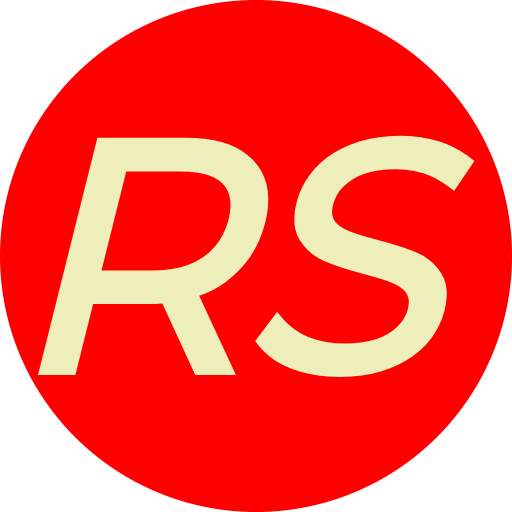

# <p align = "center"> ReSantuário </p>

<p align="center">
   
</p>

<p align = "center">
   
   
</p>

## :clipboard: Description

This is the repository used to create the FrontEnd of the best recipes site all over the internet. If you want to find new recipes with their macros like: Kcals, proteins, carbohydrates and lipids per portion. And a very friendly interface, for finding new recipes or to create yours. Just join us and start beeing the cook you are suposed to!

Just click the link below and start cooking!

https://resantuario.vercel.app/

---

## :clipboard: Usefull links

If you want to use our API server alone use this link:

https://resantuario-back.onrender.com

If you want to see more about our Back end fell free to visit our repository:

https://github.com/dimitripontocss/projeto22-ReSantuario-back

---

## :computer: Tecnologies used

- JavaScript
- React
- CustomHooks
- StyledComponents

---

## 🏁 Runnig the application

This project was bootstrapped with Create React App. So in order to run it at your machine you gotta have a stable version of Node.Js and NPM installed.

First, clone this directory:

```
git clone https://github.com/dimitripontocss/projeto22-ReSantuario-back
```

After, inside the directory, run this command to install the dependencies:

```
npm install
```

After its done run this comand to run the server:

```
npm start
```
